# AI\_Integrated\_E2EE\_Real\_Time\_Chat\_App

A modern, end-to-end encrypted (E2EE) real-time chat app with **responsive UI**,  AI-powered **user style suggestions** and **unread summaries**, built with **React + Vite + MUI**, **Node.js/Express**, **MongoDB**, **Socket.IO**, **tweetnacl** (public-key crypto), and Google Gemini.

---

## Features

1) Sign Up / Login Page
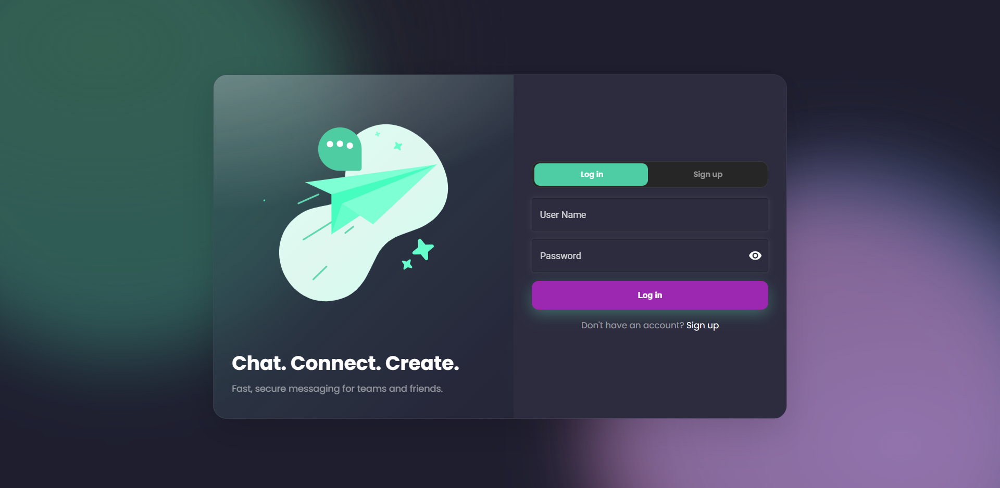

2) Main View
- User status (online/last-seen) for DMs, unread badges, and search across chats.
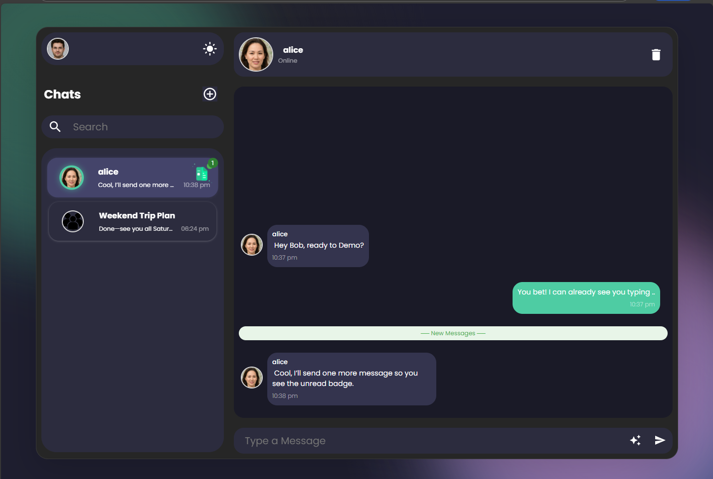
- Theme toggle
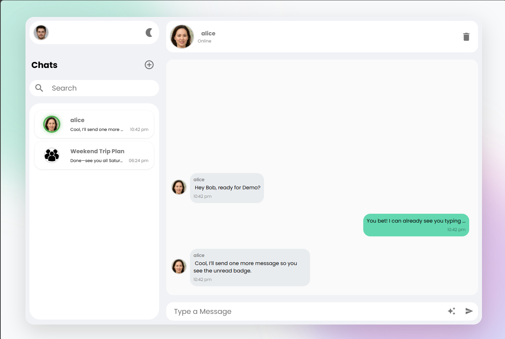
- **Responsive**: Mobile view
<p align="center">
  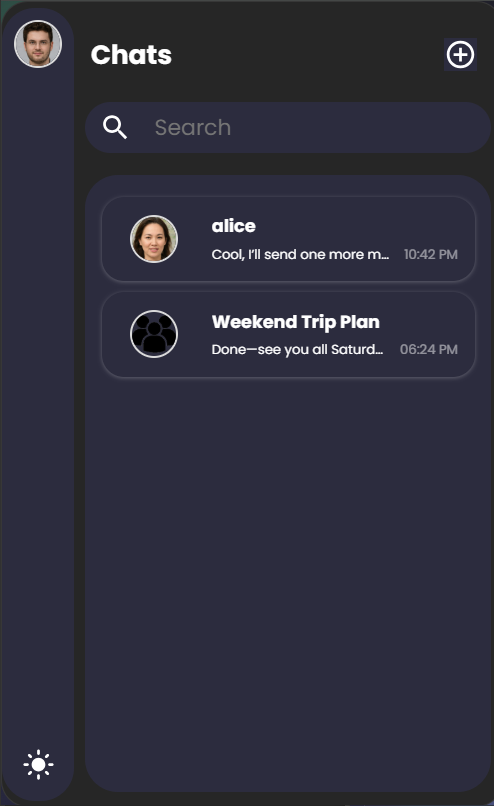
  
</p>

3) AI
- **Unread message summary**:Click summary icon next to the unread message count to view a summary.
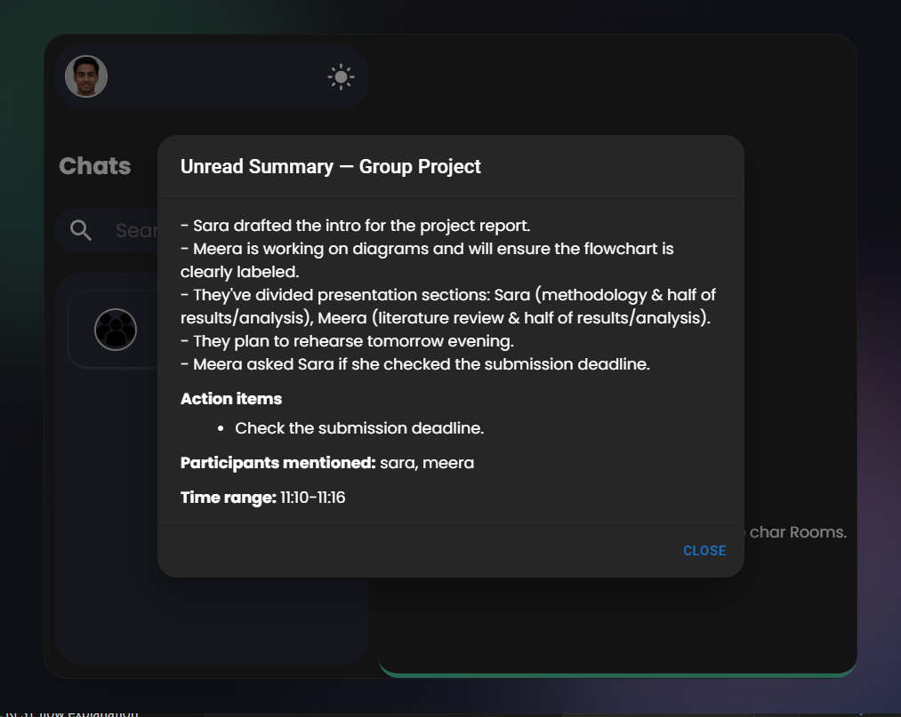
- **User-Style reply**: Click ☆ to get three suggestions.
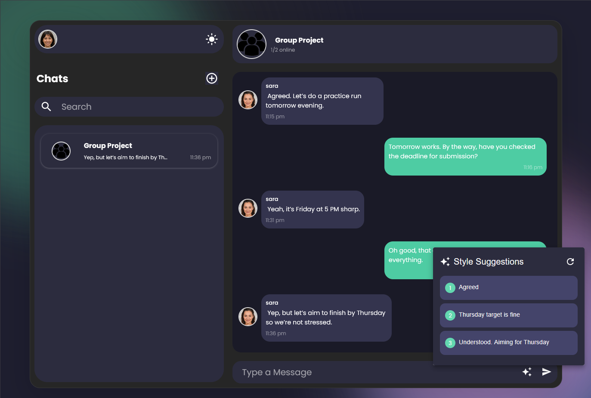

4) Groups
- Create new Group or Browse Available Groups and Request to Join.
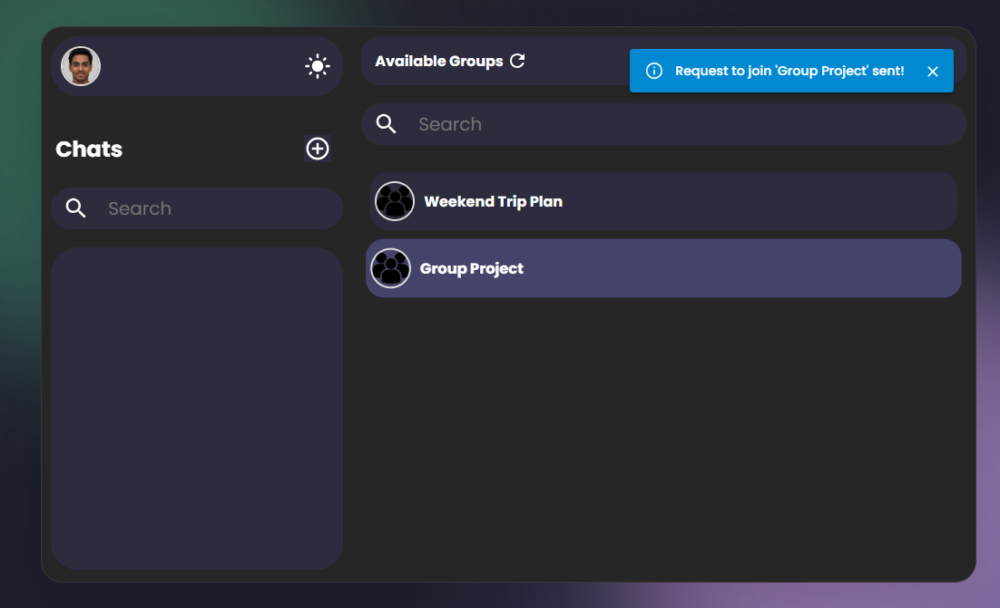
- Admin shows Pending Requests.
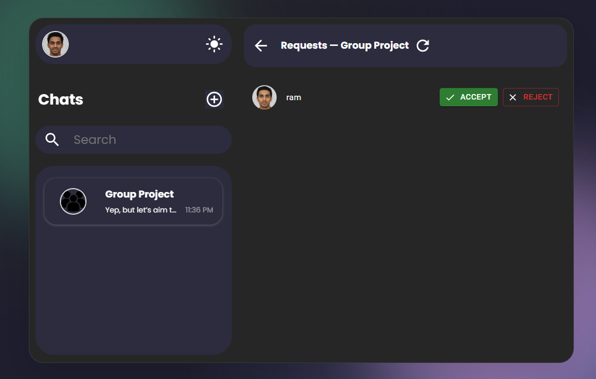

5) Direct Message
- "add User" > Browse Available users and start chatting.
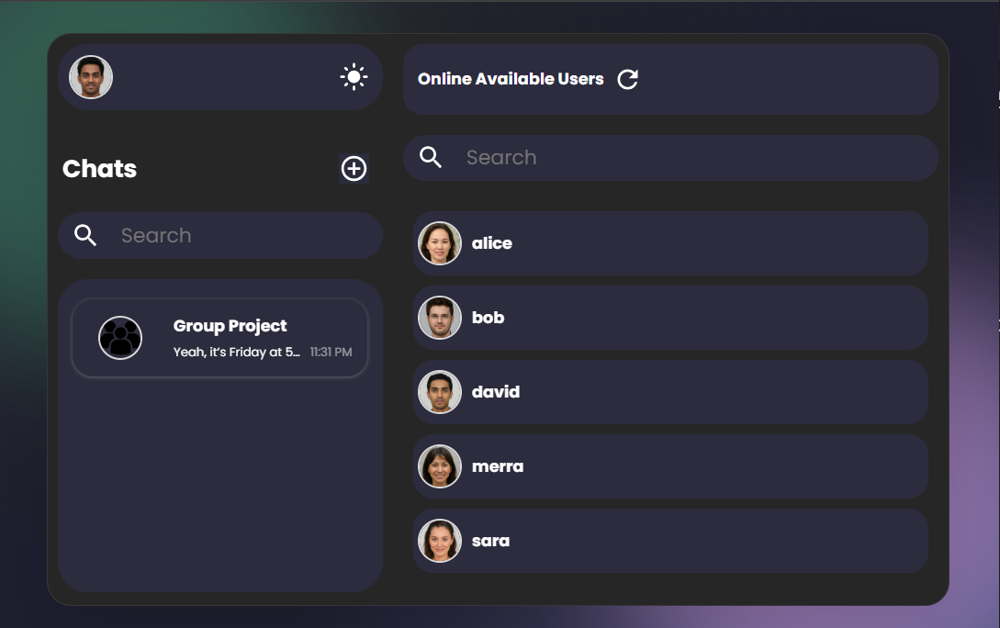

6) Typing Indicator
- Real-time typing indicator shows when another user is typing 
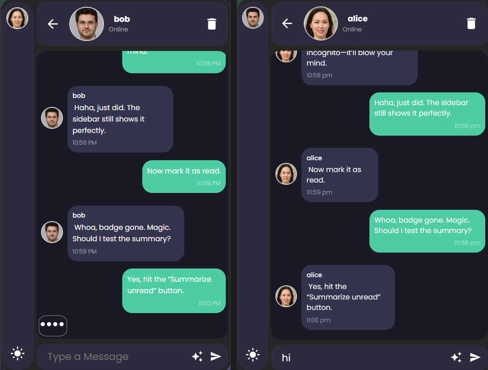
7) Profile Menu
- can upload profile pic or log out.
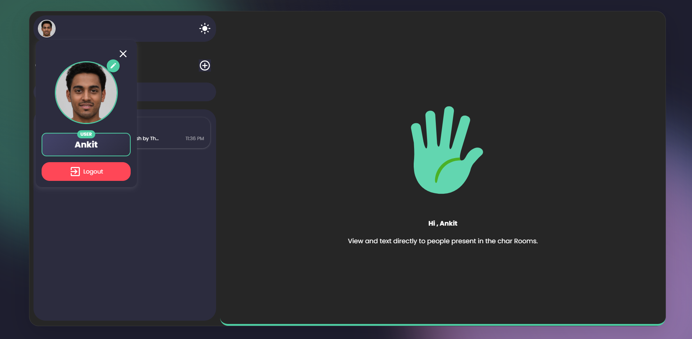

## Getting Started
#### 1) Backend
```bash
cd backend
npm install
```
Create `.env` in `backend/`:

```env
PORT=5000
MONGO_URI=mongodb://localhost:27017/ai-chat
JWT_SECRET=supersecret_change_me
FRONTEND_URL=http://localhost:5173

# Gemini
GEMINI_API_KEY=your_gemini_api_key_here
```

Run the server:

```bash
npm run dev
```

#### 2) Frontend

```bash
cd frontend
npm install
```

Create `.env` in `frontend/`:

```env
VITE_BACKEND_URL=http://localhost:5000
VITE_DEMO_MODE=false
```

Run the app:

```bash
npm run dev
```

Open: `http://localhost:5173`
